# Zere AI

> AI-powered university assistant — semantic search + streaming chat, built on Express.js + FastAPI + Next.js

---

## Содержание

- [Сервисы монорепозитория](#-сервисы-монорепозитория)
- [Архитектура](#-архитектура)
- [WebSocket протокол](#-websocket-протокол)
- [REST API](#-rest-api)
- [Переменные окружения](#-переменные-окружения)
- [Quickstart](#-quickstart)
- [Локальный запуск](#-локальный-запуск)
- [Устранение неполадок](#-устранение-неполадок)

---

## 📦 Сервисы монорепозитория

```
zereAI/
├── zere-express/        Express.js backend — API, WebSocket, CRM
├── zere-search-api/     FastAPI — векторный поиск по базе знаний
└── front-end/           Next.js — чат-интерфейс пользователя
```

| Сервис | Технология | Порт | Назначение |
|---|---|---|---|
| `zere-express` | Node.js 18 / Express 5 | 8080 | REST API, WebSocket, CRM CRUD, Auth |
| `zere-search-api` | Python 3.11 / FastAPI | 7860 | Семантический поиск, векторная модель |
| `front-end` | Next.js 16 / React 19 | 3000 | Пользовательский чат-интерфейс |

---

## 🏗 Архитектура

### Структура Express backend





```
zere-express/
├── server.js               Точка входа — HTTP + WebSocket на одном порту
├── app.js                  Express app, CORS, middleware, маршруты
│
├── config/
│   ├── env.js              Все переменные окружения в одном месте
│   ├── db.js               Supabase клиент
│   └── constants.js        Константы: Excel-колонки, лимиты, TTL кэша
│
├── routes/                 Только объявление эндпоинтов
├── controllers/            Обработка req/res, вызов сервисов
│
├── services/
│   ├── ws.service.js       WebSocket сервер, сессии, стриминг
│   ├── groq.service.js     Groq LLM API
│   ├── search.service.js   FastAPI vector search клиент
│   ├── crm.service.js      Supabase CRUD (группы, студенты)
│   └── excel.service.js    Загрузка и экспорт Excel
│
├── middlewares/            auth, logger, validation, error handler
├── validators/             express-validator схемы
└── utils/                  logger, apiResponse, asyncHandler, helpers
```

### Поток запроса чатбота (WebSocket + streaming)

```
Browser (Next.js)
    │
    │  WS connect  →  ws://host:8080/ws
    │
    │  { type: "question", question: "...", sessionId: "..." }
    │                        │
    │                   ws.service.js
    │                        │
    │  { type: "searching" } │──▶  FastAPI /search
    │                        │     (paraphrase-multilingual-MiniLM-L12-v2)
    │  { type: "search_done"}│◀──  [{ title, body, similarity }]
    │                        │
    │  { type: "generating" }│──▶  Groq API  (stream: true)
    │  { type: "token", "При"}     ◀── SSE chunk
    │  { type: "token", "вет"}     ◀── SSE chunk
    │       ...                         ...
    │  { type: "done" }      │
    │                        │
    │              История сессии сохраняется в Map<sessionId, Session>
    │              Последние 10 сообщений передаются в Groq как контекст
```

### Сессии на сервере

- Хранятся in-memory в `Map<sessionId, Session>`
- Время жизни — 2 часа с последней активности
- Сборка мусора каждые 15 минут
- Клиент передаёт `sessionId` при каждом сообщении

---

## 🔌 WebSocket протокол

Все сообщения — JSON. Соединение: `ws://host:8080/ws`

### Клиент → Сервер

| `type` | Поля | Описание |
|---|---|---|
| `question` | `question`, `sessionId` | Задать вопрос |
| `get_history` | `sessionId` | Получить историю сессии |
| `clear_history` | `sessionId` | Очистить сессию |
| `ping` | — | Проверка соединения |

### Сервер → Клиент

| `type` | Поля | Описание |
|---|---|---|
| `searching` | — | Начался поиск в базе знаний |
| `search_done` | `count`, `titles` | Поиск завершён |
| `generating` | — | Начата генерация ответа |
| `token` | `token` | Очередной токен ответа |
| `done` | `sessionId`, `messageCount` | Ответ завершён |
| `history` | `messages`, `sessionId` | История сессии |
| `history_cleared` | — | Сессия очищена |
| `error` | `message` | Ошибка |
| `pong` | — | Ответ на ping |

---

## 📋 REST API

### Публичные эндпоинты (без авторизации)

| Метод | Путь | Описание |
|---|---|---|
| `GET` | `/health` | Статус сервера + статистика WS сессий |
| `POST` | `/ai` | Fallback HTTP-эндпоинт чатбота |
| `POST` | `/auth/login` | Вход (пароль → JWT cookie) |

### Защищённые эндпоинты (JWT cookie)

| Метод | Путь | Описание |
|---|---|---|
| `GET` | `/auth/check` | Проверка токена |
| `POST` | `/auth/logout` | Выход |
| `GET` | `/crmCrud/students` | Список групп |
| `POST` | `/crmCrud/students` | Создать группу |
| `POST` | `/crmCrud/students/:id/add` | Добавить студента |
| `POST` | `/crmCrud/students/:groupId/edit/:name` | Редактировать студента |
| `POST` | `/crmCrud/students/:groupId/delete/:name` | Удалить студента |
| `POST` | `/crmCrud/students/update-group/:id` | Переименовать группу |
| `POST` | `/crmCrud/students/delete-group/:id` | Удалить группу |
| `POST` | `/crmCrud/excelRouter/upload-groups` | Загрузить Excel |
| `GET` | `/crmCrud/excelRouter/export-groups` | Экспорт в Excel |

### Формат ответа

```json
{
  "success": true,
  "message": "Operation successful",
  "data": {},
  "timestamp": "2026-04-20T11:22:28.468Z"
}
```

---

## ⚙️ Переменные окружения

### zere-express

| Переменная | Описание | Обязательна |
|---|---|---|
| `PORT` | Порт сервера (по умолчанию 8080) | Нет |
| `NODE_ENV` | `development` или `production` | Нет |
| `SUPABASE_URL` | URL Supabase проекта | Да |
| `SUPABASE_KEY` | Service key Supabase | Да |
| `GROQ_API_KEY` | Ключ Groq API | Да |
| `GROQ_MODEL` | Модель (по умолчанию `llama-3.3-70b-versatile`) | Нет |
| `SEARCH_API_URL` | URL FastAPI (Docker: `http://fastapi:7860`) | Да |
| `JWT_SECRET` | Секрет для JWT (`openssl rand -base64 32`) | Да |
| `JWT_EXPIRY` | Время жизни токена (по умолчанию `24h`) | Нет |
| `ADMIN_PASSWORD` | Пароль админ-панели | Да |

### front-end (Next.js)

| Переменная | Описание |
|---|---|
| `NEXT_PUBLIC_API_URL` | URL Express REST API (например `http://localhost:8080`) |
| `NEXT_PUBLIC_WS_URL` | URL WebSocket (например `ws://localhost:8080`) |

---

## 🚀 Quickstart

### Docker Compose (рекомендуется)

```bash
git clone <repo-url>
cd zereAI

# Создай .env в корне
cat > .env << EOF
GROQ_API_KEY=your_groq_key
JWT_SECRET=$(openssl rand -base64 32)
ADMIN_PASSWORD=your_admin_password
SUPABASE_URL=your_supabase_url
SUPABASE_KEY=your_supabase_key
EOF

docker compose up -d
```

После запуска:

| Интерфейс | Адрес |
|---|---|
| Чат (Next.js) | http://localhost:3000 |
| Express API + WS | http://localhost:8080 |
| Search API | http://localhost:7860 |

Проверка:
```bash
curl http://localhost:8080/health
docker compose ps
```

---

## 🔧 Локальный запуск

### Требования

- Node.js 18+, NPM 9+
- Python 3.11+
- Файлы `.txt` в папке `zere-search-api/data/` (база знаний)

### 1. FastAPI Search API

```bash
cd zere-search-api
pip install -r requirements.txt
uvicorn search_api:app --host 0.0.0.0 --port 7860
```

При первом запуске скачается модель `paraphrase-multilingual-MiniLM-L12-v2` (~500 MB).

```bash
# Проверка
curl http://localhost:7860/health
# {"status":"ok","documents":728}
```

### 2. Express Backend

```bash
cd zere-express
cp .env.example .env   # заполни своими ключами
npm install
npm start
```

```bash
# Проверка HTTP
curl http://localhost:8080/health

# Проверка чатбота через REST
curl -X POST http://localhost:8080/ai \
  -H "Content-Type: application/json" \
  -d '{"question": "Привет"}'
```

WebSocket доступен на `ws://localhost:8080/ws`.

### 3. Next.js Frontend

```bash
cd front-end
cp .env.example .env.local
# Укажи в .env.local:
# NEXT_PUBLIC_API_URL=http://localhost:8080
# NEXT_PUBLIC_WS_URL=ws://localhost:8080

npm install
npm run dev
```

Открой http://localhost:3000 — чат работает через WebSocket со стримингом токенов.

---

## 🛑 Устранение неполадок

| Проблема | Решение |
|---|---|
| `documents: 0` в `/health` FastAPI | Убедись что в `zere-search-api/data/` есть `.txt` файлы |
| WS-индикатор красный в интерфейсе | Проверь что Express запущен и `NEXT_PUBLIC_WS_URL` указан верно |
| `Search API unavailable` в логах Express | FastAPI ещё не запустился или неверный `SEARCH_API_URL` |
| Ошибка 401 на CRM эндпоинтах | Не передаётся JWT cookie. Выполни `POST /auth/login` сначала |
| Медленный первый запуск FastAPI | Модель скачивается (~500 MB). Ожидай 2-5 минут |
| `ENOENT: front-end/login.html` | Express ищет HTML-фронтенд. Если используешь Next.js — убери `app.use(express.static(...))` из `app.js` |

---

## 📦 Зависимости

**zere-express**

| Пакет | Назначение |
|---|---|
| `express` | Веб-фреймворк |
| `ws` | WebSocket сервер |
| `node-fetch` | HTTP-клиент для Groq и FastAPI |
| `express-validator` | Валидация входных данных |
| `@supabase/supabase-js` | БД клиент |
| `jsonwebtoken` | JWT авторизация |
| `multer` | Загрузка файлов |
| `xlsx` | Обработка Excel |
| `dotenv` | Переменные окружения |

**zere-search-api** — FastAPI + `sentence-transformers` (`paraphrase-multilingual-MiniLM-L12-v2`)

**front-end** — Next.js 16, React 19, TypeScript, Tailwind CSS 4

---

## 📝 Лицензия

© 2025–2026 Ilyas Salimov. Все права защищены. См. [LICENSE](./LICENSE).

Telegram: [@Ilyas_ones](https://t.me/Ilyas_ones)